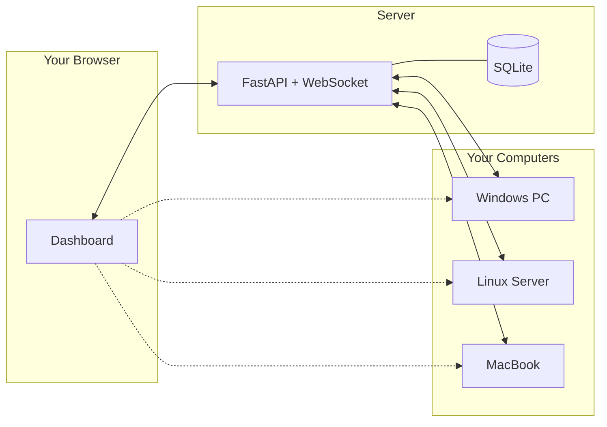
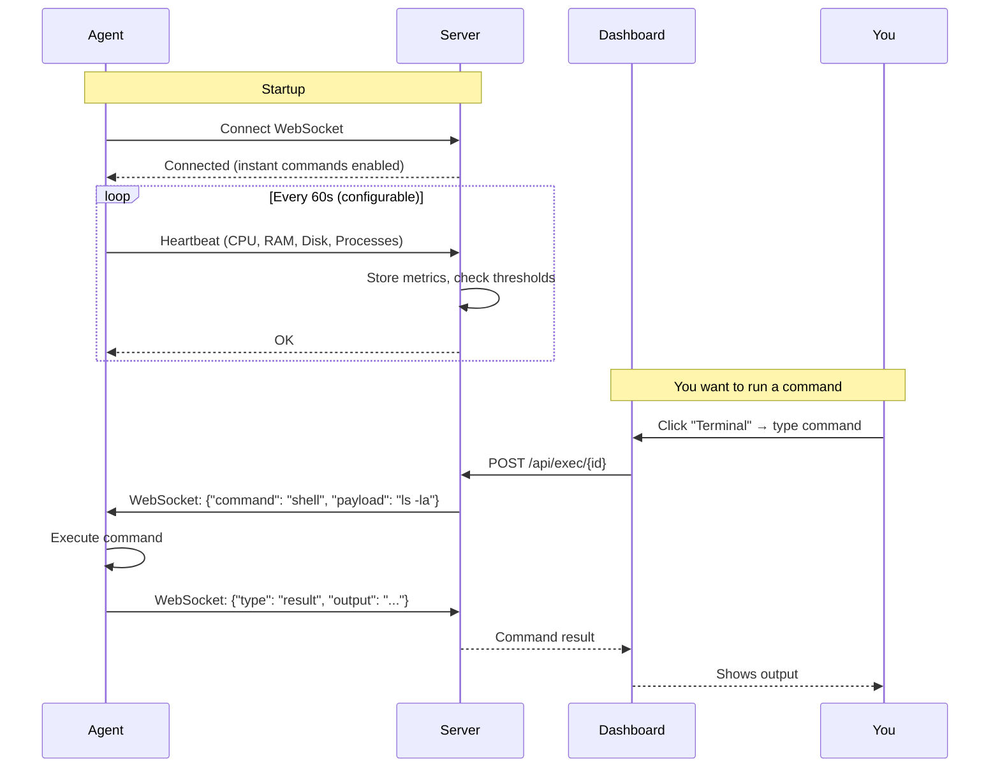

# HelpWith.IT - PC Monitor

**Monitor and control all your computers from one dashboard.** Real-time system stats, remote terminal, file browser, speed tests, and one-click remote desktop via RustDesk.

---

## Architecture



| Connection | Description |
|------------|-------------|
| Solid lines | Stats, commands, file browsing via WebSocket |
| Dotted lines | Remote desktop via RustDesk (click "Remote") |

**How it works:**
1. **Agents** run on each computer, sending stats every 60s via WebSocket
2. **Dashboard** shows all computers - click any to view details, run commands, browse files
3. **Remote Desktop** - click "Remote" to instantly connect via RustDesk (peer-to-peer)

---

## How It Works



---

## Features

| Feature | Description |
|---------|-------------|
| **Live Dashboard** | See all computers at a glance - CPU, RAM, disk, processes |
| **Remote Terminal** | Run commands on any computer from your browser |
| **File Browser** | Browse, download, and upload files remotely |
| **Speed Tests** | Test internet speed on any computer |
| **Remote Desktop** | One-click RustDesk connection with saved passwords |
| **Wake-on-LAN** | Turn on sleeping computers remotely |
| **Alerts** | Discord/webhook notifications when thresholds exceeded |
| **Historical Graphs** | Optional InfluxDB + Grafana integration |
| **Multi-User** | Multiple admin/user accounts with role-based access |
| **Auto-Update** | Agents automatically update when server has new version |

---

## Quick Start

### Step 1: Start the Server

Pick one computer to be your "server" (the one that hosts the dashboard).

**Windows:**
```powershell
# Download and run
cd C:\path\to\pc-monitor
pip install fastapi uvicorn websockets
python server/server.py
```

**Linux/Mac:**
```bash
cd ~/pc-monitor
pip install fastapi uvicorn websockets
python3 server/server.py
```

The server will display:
```
+------------------------------------------------------------------+
|                      PC Monitor Server                           |
+------------------------------------------------------------------+
|  Dashboard:      http://192.168.1.100:8000
|  Users:          admin
|  (passwords in config.json)
+------------------------------------------------------------------+
```

Open the dashboard URL in your browser. Login credentials are in `config.json`.

---

### Step 2: Add Computers to Monitor

On each computer you want to monitor, run ONE command:

**Linux/Mac:**
```bash
curl -sL http://YOUR_SERVER_IP:8000/i | bash
```

**Windows (PowerShell):**
```powershell
iwr http://YOUR_SERVER_IP:8000/i.ps1 | iex
```

Replace `YOUR_SERVER_IP` with your server's IP address (shown when server starts).

The agent will:
1. Download and configure itself automatically
2. Connect to your server
3. Appear in the dashboard within seconds

---

### Step 3: Set Up Remote Desktop (Optional)

For one-click remote control:

1. Install [RustDesk](https://rustdesk.com) on each computer (free, open source)
2. In the dashboard, click a computer → **Connect** tab
3. Click **"Setup One-Click Password"** to save the password
4. Now click **"Remote"** to instantly connect!

---

## Configuration

### Server Config (`config.json`)

Auto-generated on first run:

```json
{
  "admin_username": "admin",
  "admin_password": "auto-generated",
  "agent_api_key": "auto-generated",
  "heartbeat_interval": 60,
  "influxdb_url": "",
  "influxdb_token": "",
  "influxdb_org": "pc-monitor",
  "influxdb_bucket": "pc-metrics"
}
```

| Setting | Description |
|---------|-------------|
| `admin_username` | Dashboard login username |
| `admin_password` | Dashboard login password |
| `agent_api_key` | Secret key agents use to authenticate |
| `heartbeat_interval` | How often agents report stats (seconds) |
| `influxdb_*` | Optional: Enable historical graphs |

### Agent Configuration

Agents are auto-configured when downloaded from the server. Manual config:

```python
SERVER_URL = "http://192.168.1.100:8000"
API_KEY = "your-api-key-from-config.json"
HEARTBEAT_INTERVAL = 60
```

---

## Running as a Service

### Windows (Auto-start on Boot)

**Server:**
```batch
install-service-windows.bat
```

**Agent:** The installer prompts to add to Windows startup.

### Linux (systemd)

**Server:**
```bash
sudo ./install-service-linux.sh
```

**Agent:** The install script (`curl ... | bash`) offers to install as a service.

Or manually:
```bash
sudo tee /etc/systemd/system/pc-monitor-agent.service << EOF
[Unit]
Description=PC Monitor Agent
After=network.target

[Service]
ExecStart=/usr/bin/python3 /path/to/agent.py
Restart=always
RestartSec=10

[Install]
WantedBy=multi-user.target
EOF

sudo systemctl enable --now pc-monitor-agent
```

---

## Optional: Historical Graphs with Grafana

For pretty graphs showing metrics over time:

```bash
cd pc-monitor
docker-compose up -d
```

This starts:
- **InfluxDB** on port 8086 (time-series database)
- **Grafana** on port 3000 (visualization)

Then update `config.json`:
```json
{
  "influxdb_url": "http://localhost:8086",
  "influxdb_token": "pc-monitor-super-secret-token",
  "influxdb_org": "pc-monitor",
  "influxdb_bucket": "pc-metrics"
}
```

Access Grafana at `http://localhost:3000` (admin/admin).

---

## API Reference

All API endpoints require HTTP Basic Auth (except agent endpoints which use API key).

| Endpoint | Method | Description |
|----------|--------|-------------|
| `/api/computers` | GET | List all computers |
| `/api/computers/{id}` | DELETE | Remove a computer |
| `/api/computers/{id}/rename` | PUT | Rename a computer |
| `/api/exec/{id}` | POST | Run command on computer |
| `/api/files/{id}/browse` | POST | Browse directory |
| `/api/files/{id}/download` | POST | Download file |
| `/api/speedtest/{id}` | POST | Run speed test |
| `/api/wake/{id}` | POST | Send Wake-on-LAN |
| `/api/alerts` | GET | Get active alerts |
| `/api/settings` | GET/PUT | Manage settings |
| `/metrics` | GET | Prometheus metrics |

---

## Troubleshooting

### Agent can't connect to server?
- Check firewall allows port 8000 (both computers)
- Verify the server IP is correct (not `localhost`)
- Ensure server is running

### No CPU/memory stats?
```bash
pip install psutil
```

### Dashboard not updating?
- Check agent is running (look for heartbeat messages)
- Refresh the browser page
- Check the WebSocket connection in agent output

### Multiple agent instances running?
- Dashboard shows warning if duplicates detected
- Click "Kill Duplicates" or use the restart command

### How to find server IP?
- **Windows:** `ipconfig` → look for IPv4 Address
- **Linux/Mac:** `ip addr` or `ifconfig`

### Access from outside home network?
Use [Tailscale](https://tailscale.com) (free) to create a secure tunnel. Then use the Tailscale IP address.

---

## Project Structure

```
pc-monitor/
├── server/
│   └── server.py          # FastAPI server + dashboard
├── agent/
│   └── agent.py           # Monitoring agent
├── dashboard/
│   └── index.html         # Web interface
├── grafana/
│   ├── docker-compose.yml # InfluxDB + Grafana
│   └── provisioning/      # Grafana datasources
├── config.json            # Server configuration (auto-generated)
├── pc_monitor.db          # SQLite database
└── install-scripts/       # Generated install scripts
```

---

## Tech Stack

- **Server:** Python, FastAPI, WebSockets, SQLite
- **Dashboard:** Vanilla HTML/CSS/JavaScript
- **Agent:** Python, psutil, websockets
- **Optional:** InfluxDB, Grafana, Docker

---

## License

MIT - Free to use and modify.

---

## Links

- [Report a Bug](../../issues)
- [Ask a Question](../../discussions)
- [RustDesk](https://rustdesk.com) - Free remote desktop
- [Tailscale](https://tailscale.com) - Free secure networking
